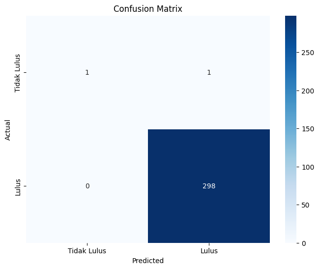
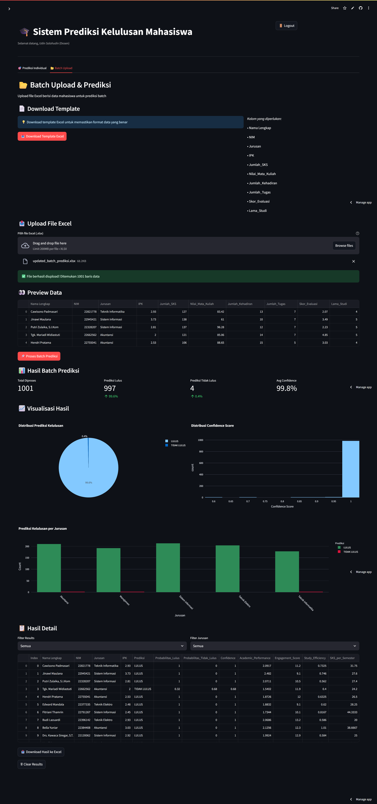
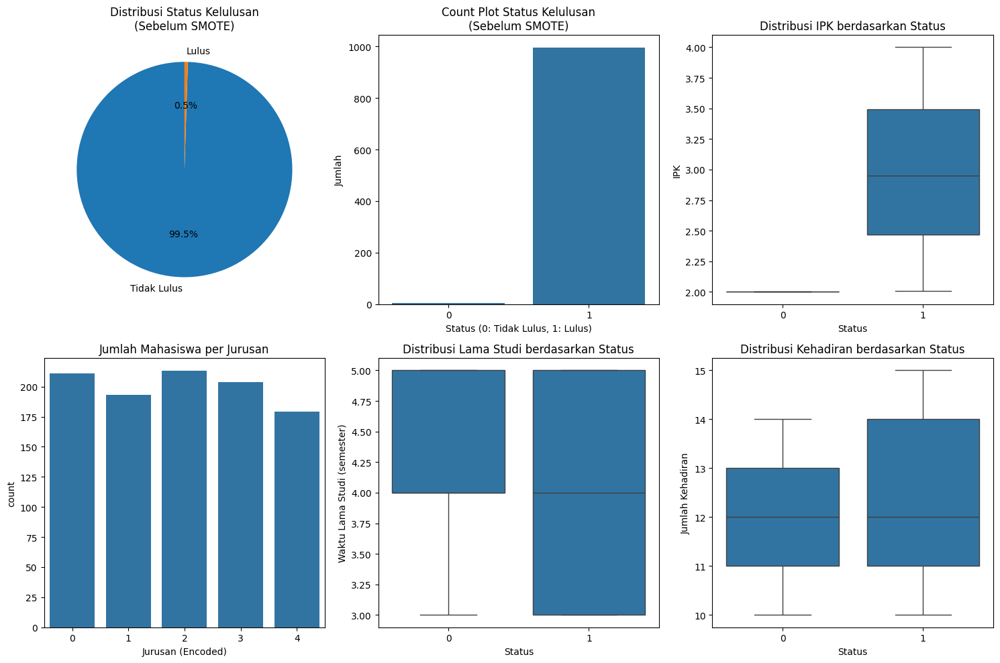
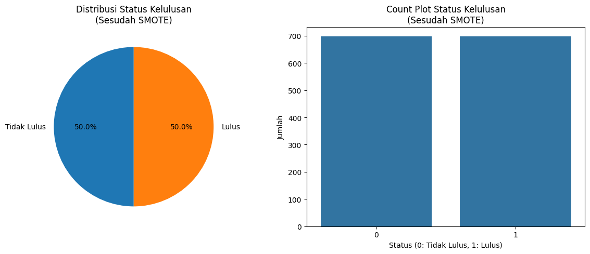

# Aplikasi Kinerja Mahasiswa

## Deskripsi

Aplikasi ini dikembangkan untuk memantau dan menampilkan kinerja akademik mahasiswa. Dilengkapi fitur:

- Input dan penyimpanan data nilai mahasiswa
- Penghitungan indeks prestasi (IP) otomatis
- Tampilan grafik atau statistik kinerja
- Ekspor data (CSV/Excel)

**Stack teknologi**:

- Bahasa Pemrograman: Python
- Framework: Streamlit

## Machine Learning

- Algorithm: Random Forest
- Trained model saved as `random_forest_model.pkl`

## Model Evaluation



## Interface



## Data Visualtization





## Installation

# Clone the repository

```bash
git clone https://github.com/VickyArdiansyah03/Aplikasi_Kinerja_Mahasiswa.git
cd Aplikasi_Kinerja_Mahasiswa
```

# Install dependencies

```bash
pip install -r requirements.txt
```

# Run the app

```bash
streamlit run app.py
```
